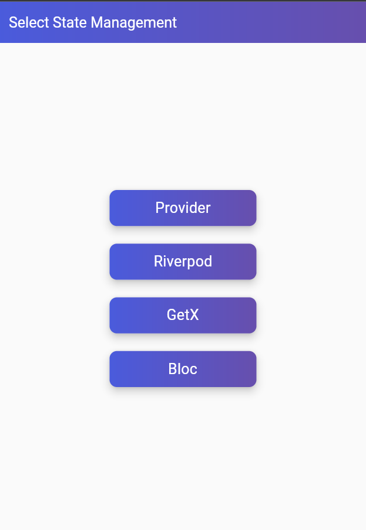
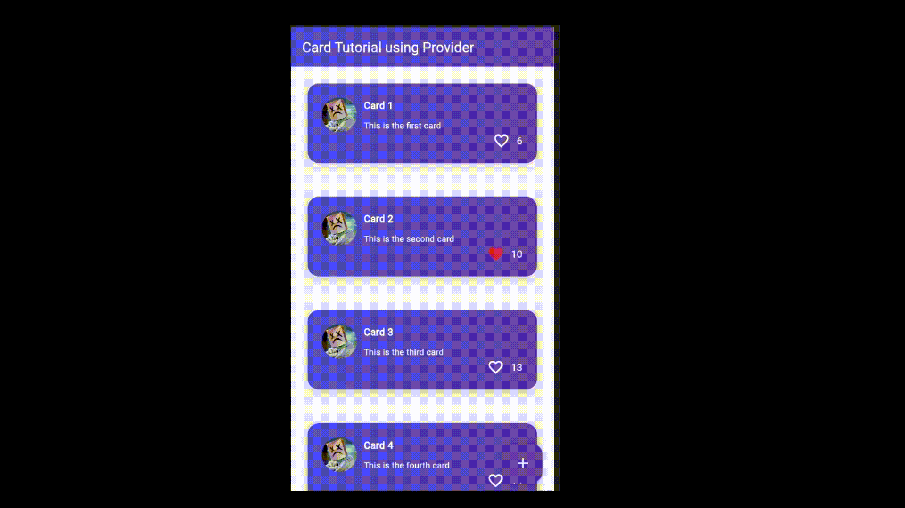

# Flutter Card State-Management

## Problem statement

Suppose you have list of cards with different atributes for eg. `name`,`description`,`image`,`likeCount`,`isLikedByUser` etc. Now you want to show these cards in a listview and you want to update the `likeCount` and `isLikedByUser` when user likes the card. You can do this by using `setState` but this will rebuild the whole listview which is not efficient. So we need a way to update the state of a card without rebuilding the whole listview.

## Solution

We can use `InheritedWidget` to solve this problem. We will create a `CardState` class which will be inherited by `InheritedWidget` and will be used to update the state of the card. We will also create a `CardStateContainer` widget which will be used to wrap the listview and will provide the `CardState` to the listview. but as we know `InheritedWidget` is not the best way to manage state so we will use `Provider` package to manage the state or other State-Management tools.

## File Structure

- For each **State-Management**, we will have either `controllers` or `providers` depends on State-Management.

- **lib/widgets**: In this, we will keep only common widgets like `home_screen` and `card_container` that will be reuseable across other State-Management package.
    - `common_home_screen.dart`
    - `card_container.dart`

- **lib/models/** : contains Serialized `JSON` data class.

- **lib/constant.dart**: contains only Constants objects or functions.

    - `CardStatesModel()`: Model class will keep state of Individual card,for example we have to enable toggle like button so we need to show loading indicator on particular card so basically it work  like this `index==cardIndex` and also `loading==true`.

    - `createCard()`:Function will return a new card using index.


## Mutables

- `isLoading`: if true, then `CircularProgressIndicator()` will be visible on HomeScreen.

- `cardState`: if `cardState[index]==index && cardState['isLoading`],then`CircularProgressIndicator()` will be visible on Indexed Card.

- `cardList`: List of `CardModel`,will change on **toggle like**,**adding new card** and removing **existing card**.


# Using Provider as State-Management

- First, we will wrap our `MaterialApp` using `Multiproivder`.

- `CardsStateProvider()` will extends `ChangeNotifier`.

- Will update states using `notifyListeners()`.


# Using RiverPod as State-Management

- Again, we will wrap our `MaterialApp` using `ProviderScope`.

- Will use `StateNotifier` as `CardStates class` while extending `CardsController` class.

- In place of `stateless widget`, we will be using `ConsumerWidget`.

    ``` 
        Widget build(BuildContext context, WidgetRef ref) {
        final cardStates = ref.watch(cardListProvider);
        final cardList = cardStates.cardList;
        bool isLoading = cardStates.isLoading;
        return SomeWidget();
        }
    ```


# Using Getx as State-Management

- For this, we will be using `GetMaterialApp()` in place of `MaterialApp()`.

- `CardControllerGetx` will extends `GetxController` and all the mutables will be `Rx` with type `obs`.

- `Get.put(CardControllerGetx())`: will initialize controller and then `GetX` builder will be use to watch changes.

# using Bloc 

- For this, we will be using `MultiBlocProvider` in place of `ProviderScope`.

- `CardStateProviderBloc` will be extend as `Bloc<CardStateBlocEvents, CardStateBlocState>` where `CardStateBlocEvents` and `CardStateBlocState` are events and states for the following provider.

- Types of Events:
    - `CardStateBlocEventsToggleLike`: will be used to toggle like on card.
    - `CardStateBlocEventAddNewCard`: will be used to add new card.
    - `CardStateBlocEventDeleteCard`: will be used to remove existing card.

- Types of States:
    -  `CardStateBloc `will  extends `CardStateBlocState` and will be used to update the state of the card using `copyWith` method.


# Switching between different State-Management

- `state_management_selection_screen.dart` will be used to switch between different State-Management.




# Build Runner

```
   flutter packages pub run build_runner build --delete-conflicting-outputs
```


# Output

